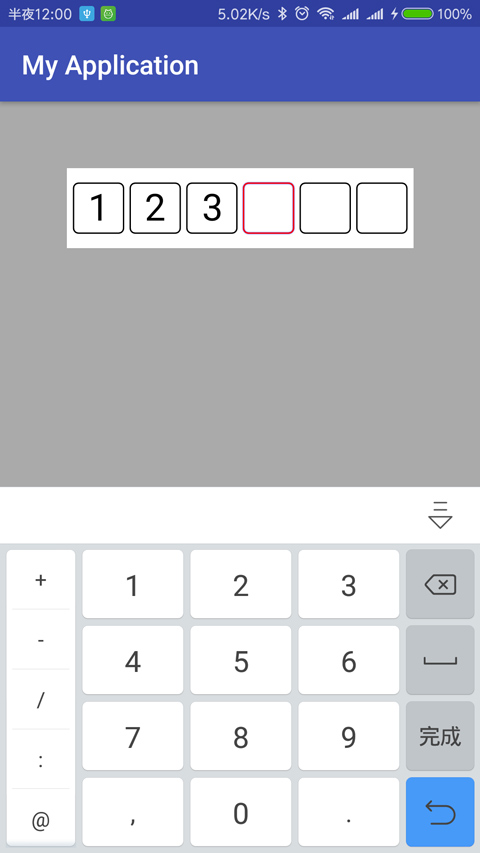
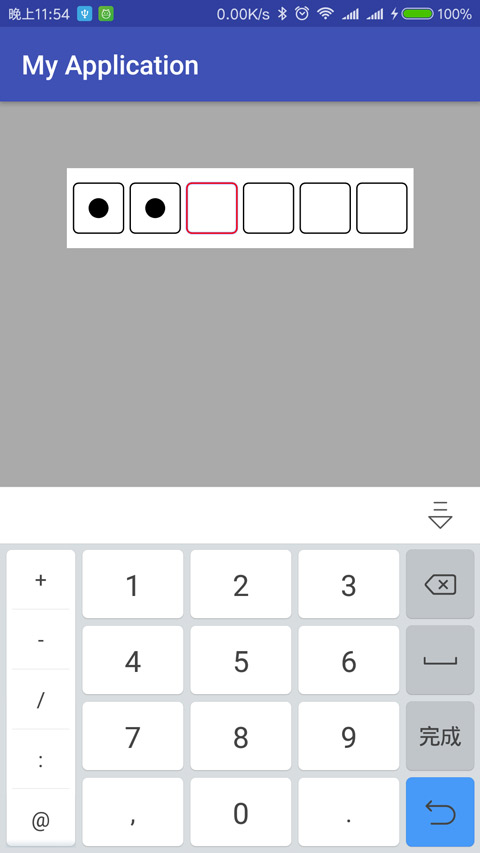

## PEditTextView
### Demo

</br>

### How To Use

[](https://jitpack.io/#limxing/PEditTextView)

Step 1. Add the JitPack repository to your build file

```
allprojects {
     repositories {
         ...
         maven { url 'https://jitpack.io' }
     }
 }
```
Step 2. Add the dependency

	dependencies {
	        compile 'com.github.limxing:PEditTextView:1.0'
	}

Step 3. Add the layout


    <me.leefeng.viewlibrary.PEditTextView
       android:layout_width="400dp"
       android:layout_height="60dp"
       android:layout_margin="50dp"
       android:background="#fff"
       android:padding="5dp"
       app:is_password="false"
       app:length="6" />


### License

```
Copyright  2018 leefeng.me

Licensed under the Apache License, Version 2.0 (the "License");
you may not use this file except in compliance with the License.
You may obtain a copy of the License at

   http://www.apache.org/licenses/LICENSE-2.0

Unless required by applicable law or agreed to in writing, software
distributed under the License is distributed on an "AS IS" BASIS,
WITHOUT WARRANTIES OR CONDITIONS OF ANY KIND, either express or implied.
See the License for the specific language governing permissions and
limitations under the License.
```